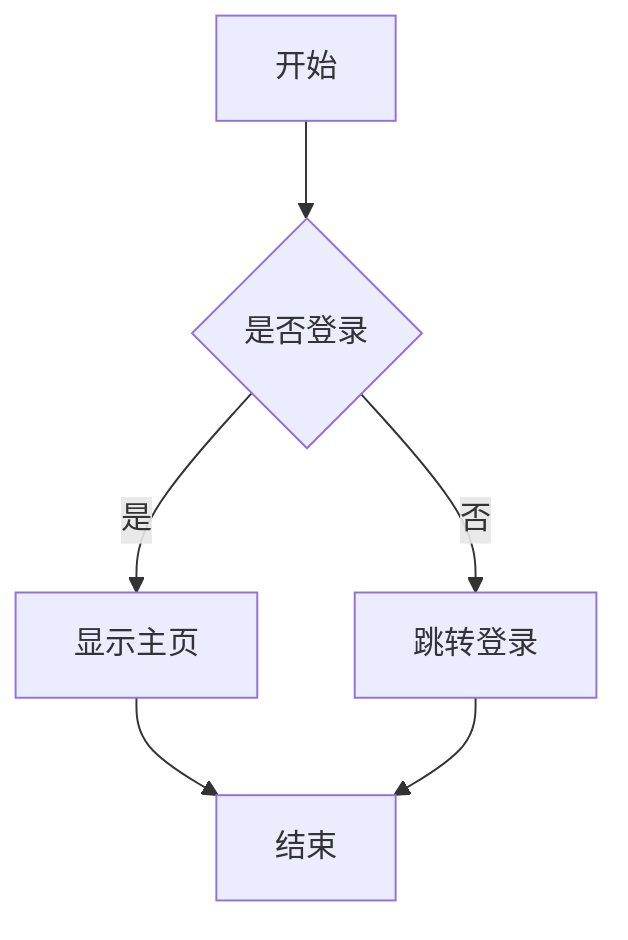

# Hexo 服务端 Mermaid 和 KaTeX 配置指南

## 📋 概述

本文档提供在 Hexo 博客端配置 Mermaid 图表和 KaTeX 数学公式**服务端预渲染**的完整步骤。

**为什么选择服务端预渲染？**
- ✅ **零运行时成本** - 客户端无需加载渲染库
- ✅ **100% 兼容** - 所有平台（H5、小程序、App）完美显示
- ✅ **完美渲染** - 使用官方渲染引擎,效果最佳
- ✅ **性能最优** - 图表/公式已经是 HTML/SVG,直接显示

---

## 🎯 方案一：使用 hexo-filter-mermaid-diagrams (推荐 ⭐⭐⭐⭐⭐)

### 1. 安装插件

在你的 Hexo 博客根目录执行:

```bash
cd /path/to/your/hexo/blog
npm install hexo-filter-mermaid-diagrams --save
```

### 2. 配置 Hexo

编辑 Hexo 根目录的 `_config.yml`,添加:

```yaml
# Mermaid 配置
mermaid:
  enable: true
  # 主题: default, dark, forest, neutral
  theme: dark
  # 其他配置项（可选）
  options:
    startOnLoad: true
    securityLevel: 'loose'
```

### 3. 在文章中使用

在你的 Markdown 文章中使用标准的 Mermaid 代码块:

````markdown

````

### 4. 重新生成博客

```bash
hexo clean
hexo generate
```

### 5. 验证效果

生成后的 HTML 文件中,Mermaid 代码会被转换为 `<svg>` 图形:

```html
<div class="mermaid">
  <svg id="mermaid-xxx" width="100%" ...>
    <!-- SVG 内容 -->
  </svg>
</div>
```

UniApp 客户端使用 `mp-html` 可以直接显示这些 SVG 图形,无需任何额外配置。

---

## 🎯 方案二：使用 hexo-renderer-markdown-it-plus (替代方案)

如果你想同时支持 Mermaid 和 KaTeX,可以使用这个插件。

### 1. 卸载默认渲染器并安装新渲染器

```bash
npm uninstall hexo-renderer-marked --save
npm install hexo-renderer-markdown-it-plus --save
```

### 2. 安装 Mermaid 和 KaTeX 依赖

```bash
npm install markdown-it-mermaid --save
npm install markdown-it-katex --save
```

### 3. 配置 Hexo

编辑 `_config.yml`:

```yaml
# Markdown-it 配置
markdown_it_plus:
  plugins:
    - markdown-it-katex
    - markdown-it-mermaid
  highlight: true
  html: true
  linkify: true
  typographer: true
  breaks: true
```

### 4. 添加 KaTeX 样式

如果需要数学公式,在主题的 `head.ejs` 或 `_layout.ejs` 中添加:

```html
<link rel="stylesheet" href="https://cdn.jsdelivr.net/npm/katex@0.16.8/dist/katex.min.css">
```

### 5. 重新生成

```bash
hexo clean
hexo generate
```

---

## 🎯 方案三：使用 hexo-tag-mermaid (标签插件)

如果你希望使用 Hexo 标签而不是代码块。

### 1. 安装插件

```bash
npm install hexo-tag-mermaid --save
```

### 2. 在文章中使用

使用 Hexo 标签语法:

```markdown

graph TD
    A[开始] --> B[结束]

```

### 3. 重新生成

```bash
hexo clean
hexo generate
```

---

## 📊 KaTeX 数学公式配置

### 方案 A：使用 hexo-renderer-markdown-it-plus (推荐)

已在方案二中说明,可同时支持 Mermaid 和 KaTeX。

### 方案 B：使用 hexo-filter-mathjax

```bash
npm install hexo-filter-mathjax --save
```

配置 `_config.yml`:

```yaml
mathjax:
  enable: true
  mhchem: false
```

在文章中使用:

```markdown
行内公式: $E = mc^2$

块级公式:
$$
\int_{-\infty}^{\infty} e^{-x^2} dx = \sqrt{\pi}
$$
```

---

## 🔍 验证配置是否生效

### 1. 检查生成的 HTML

生成博客后,查看 `public/` 目录下的 HTML 文件:

```bash
# 查看某篇包含 Mermaid 的文章
cat public/2019/04/09/TalkAbout/talkabout-markdown-mermaid/index.html | grep -A 20 "mermaid"
```

应该看到类似:

```html
<div class="mermaid">
  <svg id="mermaid-1234567890" width="100%" xmlns="http://www.w3.org/2000/svg">
    <!-- SVG 路径和形状 -->
  </svg>
</div>
```

### 2. 测试 API 返回

如果你的 Hexo 博客有 API 接口,检查返回的 JSON:

```bash
curl https://blog.yahui.wang/api/posts/2019/04/09/TalkAbout/talkabout-markdown-mermaid.json
```

`content` 字段应该包含渲染好的 SVG 代码。

---

## 🚀 推荐配置组合

### 组合 A：最简单 (仅 Mermaid)

```bash
npm install hexo-filter-mermaid-diagrams --save
```

### 组合 B：全功能 (Mermaid + KaTeX)

```bash
npm uninstall hexo-renderer-marked --save
npm install hexo-renderer-markdown-it-plus --save
npm install markdown-it-mermaid --save
npm install markdown-it-katex --save
```

配置 `_config.yml`:

```yaml
markdown_it_plus:
  plugins:
    - markdown-it-katex
    - markdown-it-mermaid
  highlight: true
  html: true
```

---

## 📝 客户端无需修改

配置好 Hexo 服务端后,UniApp 客户端**无需任何代码修改**。

现有的 `mp-html` 组件会自动:
- ✅ 渲染 SVG 图形 (Mermaid 图表)
- ✅ 显示 KaTeX 样式的数学公式
- ✅ 保持 Prism.js 代码高亮

---

## ⚠️ 常见问题

### Q1: Mermaid 图表不显示

**检查清单:**
1. 是否执行了 `hexo clean` 和 `hexo generate`
2. 查看生成的 HTML 是否包含 `<svg>` 标签
3. 检查 `_config.yml` 中 `mermaid.enable: true`

### Q2: 数学公式显示异常

**解决方案:**
1. 确认引入了 KaTeX CSS 样式
2. 检查公式语法是否正确
3. 尝试重新生成博客

### Q3: 如何选择主题？

在 `_config.yml` 中设置:

```yaml
mermaid:
  theme: dark  # default, dark, forest, neutral
```

- `default` - 白底蓝色主题
- `dark` - 暗色主题 (推荐,与代码高亮风格一致)
- `forest` - 绿色主题
- `neutral` - 中性灰色主题

---

## 🎨 样式自定义 (可选)

如果需要自定义 Mermaid 图表样式,可以在主题的 CSS 中添加:

```css
/* 自定义 Mermaid 样式 */
.mermaid {
  background: #f8f9fa;
  padding: 20px;
  border-radius: 8px;
  margin: 30px 0;
}

.mermaid svg {
  max-width: 100%;
  height: auto;
}
```

---

## 📚 参考资源

- [hexo-filter-mermaid-diagrams](https://github.com/webappdevelp/hexo-filter-mermaid-diagrams)
- [hexo-renderer-markdown-it-plus](https://github.com/CHENXCHEN/hexo-renderer-markdown-it-plus)
- [Mermaid 官方文档](https://mermaid.js.org/)
- [KaTeX 官方文档](https://katex.org/)

---

## ✅ 完成检查清单

- [ ] 安装 Hexo 插件
- [ ] 配置 `_config.yml`
- [ ] 执行 `hexo clean && hexo generate`
- [ ] 检查生成的 HTML 包含 SVG
- [ ] 验证 API 返回正确的内容
- [ ] 在 UniApp 客户端测试显示效果
- [ ] (可选) 自定义样式

---

**文档创建时间**: 2026-02-15
**状态**: 生产就绪,推荐使用
**维护者**: [YahuiWong](https://github.com/YahuiWong)
